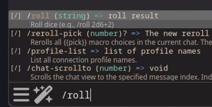
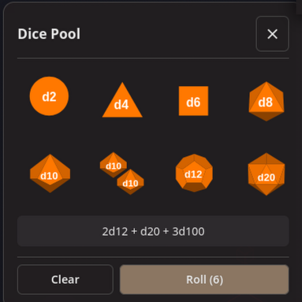
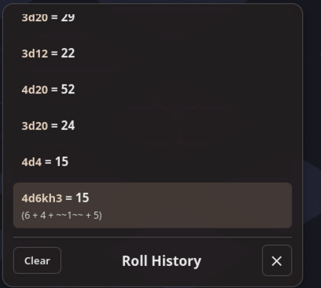
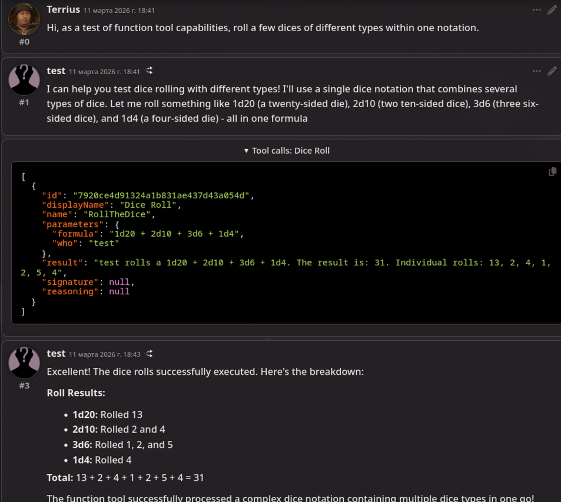

# 3D Dice Roller

Roll dices in SillyTavern. Fast, behind the screen, or with stunning 3D physics.

---

## Why This Extension?

- **Quick rolls** — Behind-the-screen dice for fast gameplay
- **Realistic 3D** — Physics-based dice (d4, d6, d8, d10, d12, d20, d100)
- **Flexible triggers** — Roll via `/roll`, UI buttons, or AI function calls
- **Multiple outputs** — History panel, prompt injection, or system chat message

---

## Installation

Via SillyTavern extension manager:

```
https://github.com/Alamion/SillyTavern-3DDiceRolls
```

Or manual: clone to `SillyTavern/data/default-user/extensions/`.

---

## Usage

![GIF placeholder]

### Command
Supports [dice notation](https://dice-roller.github.io/documentation/guide/notation/) (in a simplified form for now)

```
/roll 2d6+3
/roll 4d20kh3
```



### UI Buttons



### Roll History



### AI Function Calls

Enable "AI function tool" in settings. AI can now call `RollTheDice` with formulas like `"1d20+5"`.



### External Extensions

Other SillyTavern extensions can trigger dice rolls via the event system. The roll uses this extension's settings (3D/2D mode, output destinations).

```typescript
// Trigger a roll from another extension
const context = SillyTavern.getContext();
context.eventSource.emit('3ddicerolls:roll', { notation: '2d6+3' });
```

---

## Build from Source

```bash
npm install
npm run build
```

Output: `dist/index.js`

---

## Credits

- **Jeremy Valentine** ([javalent/dice-roller](https://github.com/javalent/dice-roller)) — Three.js-based 3D dice rendering code
- **Cohee1207** ([Extension-Dice](https://github.com/SillyTavern/Extension-Dice)) — Original dice rolling idea for SillyTavern

---

## License

MIT
