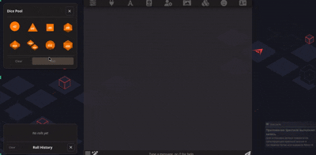

# 3D Dice Roller

Roll dice in SillyTavern with full dice notation, realistic 3D physics, and a
unified UI panel. Supports D&D, World of Darkness, Fate/Fudge, and custom dice.


---

## Features

- **Full dice notation** — `4d20kh3`, `(2d6+3)*2`, `10d10>=6`, `dF`, `d[1,3,5]`
- **3D physics** — Three.js + Cannon-es with adaptive camera and loading spinner
- **Unified panel** — Toolbar-integrated toggle with dice pool + roll history
- **Three tabs** — Standard, D&D (with ADV/DIS), WoD (difficulty slider)
- **Roll history** — Per-chat with expandable details, favorites, recent
- **Favorites system** — Save/load favorite notations globally
- **Customizable colors** — Dice faces and text (auto light/dark theme)
- **AI function tool** — Let AI roll dice via `RollTheDice`
- **External API** — Other extensions trigger rolls via events
- **Slash command** — `/roll` and `/r` with `quiet` mode

---

## Installation

Via SillyTavern extension manager:

```
https://github.com/Alamion/SillyTavern-3DDiceRolls
```

Or manual: clone to `SillyTavern/data/default-user/extensions/`.

Requires `pnpm install && pnpm run build` when building from source
(see [Development](docs/development.md)).

---

## Quick Start

1. Click the **d20 icon** in the SillyTavern toolbar to open the panel
2. Click a die to add to the editor, or type a notation like `2d6+3`
3. Press **Enter** or click **Roll**
4. Watch the 3D physics (or quick 2D result)
5. Result appears in the history panel below



---

## Docs

| Document | Contents |
|----------|----------|
| [Usage Guide](docs/usage.md) | Full UI walkthrough, settings, commands, API |
| [Notation Reference](docs/notation.md) | All dice types, modifiers, operators, custom faces |
| [Development](docs/development.md) | Build from source, project structure, tests |

### Quick Reference

- **Left-click** die: Add to notation
- **Right-click** die: Remove from notation
- **Left-click ↻** (history): Set notation in editor
- **Right-click ↻** (history): Roll immediately
- **Click history body**: Toggle expanded details
- **Star icon**: Toggle favorite

### Settings

| Setting | Description |
|---------|-------------|
| Show dice button | Show/hide the panel toggle |
| Enable 3D Dice Rolls | Toggle 3D physics on/off |
| Inject result in user prompt | Append result to message box |
| Send result as chat message | Send as system message |
| Enable AI function tool | Let AI call `RollTheDice` |
| Primary dice color | Dice face color |
| Secondary dice color | Dice text color |

### Commands

```
/roll 2d6+3
/r 4d20kh3
/roll (2d6+3)*2 quiet=true
```

---

## Credits

- **Jeremy Valentine** ([dice-roller](https://github.com/javalent/dice-roller)) — Three.js-based 3D dice rendering code
- **Cohee1207** ([Extension-Dice](https://github.com/SillyTavern/Extension-Dice)) — Original dice rolling idea for SillyTavern
- **GreenImp Lee Langley** ([rpg-dice-roller](https://github.com/dice-roller/rpg-dice-roller)) - a massive work on how dice notation should look like and work

## License

MIT
