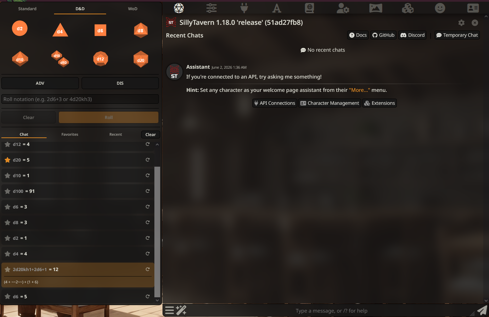
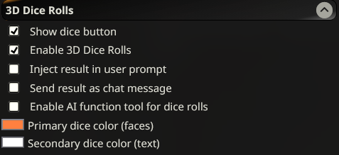

# Usage Guide

---

## Quick Start

1. Install the extension (see [README](../README.md#installation))
2. Click the **d20 icon** (`fa-dice-d20`) in the SillyTavern toolbar
3. The dice panel opens with three tabs: **Standard**, **D&D**, **WoD**
4. Click a die to add it to the notation editor, type a custom notation, or use `/roll`

---

## Dice Panel

The panel is toggled by the **d20 icon** in the `.top-settings-holder` toolbar.
It contains two sections:

1. **Dice Pool** (top) — tabbed dice grid + notation editor + Roll/Clear buttons
2. **Roll History** (bottom) — per-chat history, favorites, recent notations



---

## Tabs

### Standard Tab

A grid of all supported dice: d2, d4, d6, d8, d10, d100, d12, d20, **dF** (Fudge).

- **Left-click**: Add die to notation editor
- **Right-click**: Remove last matching die from notation

### D&D Tab

Same dice grid minus dF (d2 through d20), plus **ADV** / **DIS** buttons:

| Button | Effect                                                   |
|--------|----------------------------------------------------------|
| ADV    | Apply advantage to the first d20 (doubles count, adds `khN`) |
| DIS    | Apply disadvantage to the first d20 (doubles count, adds `klN`) |

Clicking ADV or DIS on an already-advantaged/disadvantaged notation toggles
it back to a bare d20.

- **Left-click** on die: Add to notation
- **Right-click** on die: Remove from notation

### WoD (World of Darkness) Tab

A **difficulty slider** (1–10, default 6) and a single **d10** button.

- **Left-click** d10: Adds `d10>=N` with current difficulty
- **Right-click** d10: Removes last d10
- Difficulty `-`/`+` controls change the target number

Uses the success-counting mechanic: sum = successes - failures.

---

## Notation Editor

Located below the dice tabs. Key features:

- **Text input**: Type any dice notation (e.g. `2d6+3`, `4d20kh3`)
- **Live validation**: `✓` (valid) / `✗` (invalid) indicator
- **Favorite star**: When notation is valid, click the star to save/remove
  from global favorites
- **Invalid notation**: Shows question-mark icon linking to the
  [dice notation reference](https://dice-roller.github.io/documentation/guide/notation/)
- **Enter**: Submit (roll) when valid
- **Clear** button: Reset editor
- **Roll** button: Execute the current notation

---

## Roll History

Three tabs below a divider in the panel:

### Chat Tab

Shows all rolls from the current chat session (most recent first).
Persisted per-chat via `chatMetadata['3d_dice_rolls']`.

| Interaction | Behavior |
|-------------|----------|
| Click body | Set notation in editor + toggle expanded details |
| Click star | Toggle favorite status |
| Left-click ↻ | Set notation in editor |
| Right-click ↻ | Roll immediately |

**Clear** button removes all history for the current chat.

### Favorites Tab

Global list of saved favorite notations. Persisted to extension settings.

| Interaction | Behavior |
|-------------|----------|
| Click star (filled) | Remove from favorites |
| Left-click ↻ | Set notation in editor |
| Right-click ↻ | Roll immediately |

### Recent Tab

Last 10 unique notations used across all chats. Persisted globally.

| Interaction | Behavior |
|-------------|----------|
| Left-click ↻ | Set notation in editor |
| Right-click ↻ | Roll immediately |

---

## Settings

Accessible from the SillyTavern **Extensions** panel (collapsible inline-drawer).

| Setting | Type | Default | Description |
|---------|------|---------|-------------|
| Show dice button | boolean | `true` | Show/hide the dice panel toggle in toolbar |
| Enable 3D Dice Rolls | boolean | `true` | Toggle 3D physics simulation on/off |
| Inject result in user prompt | boolean | `false` | Append roll result to the textarea |
| Send result as chat message | boolean | `false` | Send result as a system chat message |
| Enable AI function tool for dice rolls | boolean | `false` | Let AI call `RollTheDice` |
| Primary dice color (faces) | color | `#7e7e7e` | Color of dice faces (2D + 3D) |
| Secondary dice color (text) | color | `#ffffff` | Color of text on dice (2D + 3D) |



---

## Slash Command

**`/roll`** (alias **`/r`**)

```
/roll 2d6+3
/r 4d20kh3
/roll (2d6+3)*2 quiet=true
```

- **Unnamed arg**: Dice notation formula (required)
- **`quiet`**: Boolean, suppresses output (optional, default `false`)
- **Returns**: The numeric total as a string (usable in macros)
- **On error**: Returns `"Failed to roll notation: ..."`

---

## AI Function Tool

When enabled in settings and supported by the model/backend:

- Tool name: **`RollTheDice`**
- Parameters:
  - `formula` (string, required): Dice notation to roll
  - `who` (string, optional): Persona rolling the dice
- Returns a descriptive string with total and individual rolls

The AI can call this to roll dice when appropriate. Works with all
standard notation, modifiers, and respects the 3D/2D setting.

---

## External Extension API

Other SillyTavern extensions can trigger dice rolls via events or direct import.

### Event API

```javascript
const ctx = SillyTavern.getContext();
ctx.eventSource.emit('3ddicerolls:roll', { notation: '2d6+3' });
// Optional: { notation, quiet: true }
```

The event listener string is also accepted:

```javascript
ctx.eventSource.emit('3ddicerolls:roll', '2d6+3');
```

### Direct Import

```typescript
import { triggerRoll } from './utils/events';
const result = await triggerRoll('1d20+5');
// result is RollResult | null
```

Both methods use the extension's current settings (3D/2D mode, output routing).

For more detail, see [docs/README.md#external-api](development.md#external-api).
